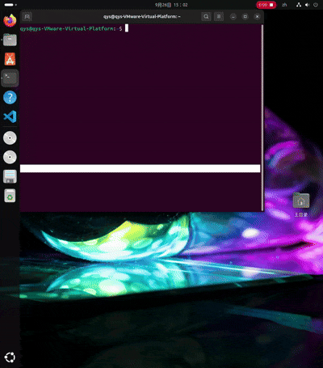

# Red Ball Grasping Demo: KUKA + ROS2 + PyBullet Grasping Demo

A ROS2-based robotic grasping system that uses computer vision to detect a
target, computes inverse kinematics, and controls a KUKA iiwa arm with a
prismatic gripper in PyBullet simulation.

## Architecture

The system consists of three ROS2 nodes:

- `camera_publisher`: generates an image containing a red ball and publishes it
  to `camera_image`.
- `vision_to_arm`: subscribes to `camera_image`, detects the red ball,
  and publishes a grasp command to `joint_command`.
- `robot_driver`: places the ball at a random position, publishes the position
  to `target_position`, receives the grasp command, and executes the full
  pick-and-place motion.

Data flow:

    robot_driver  --target_position-->  camera_publisher
    camera_publisher  --camera_image-->  vision_to_arm
    vision_to_arm  --joint_command-->  robot_driver

## Requirements

- Ubuntu 24.04 (tested on VMware)
- ROS2 Jazzy
- Python 3.12
- PyBullet
- OpenCV
- NumPy

## Build

    cd ~/ros2_ws
    colcon build --packages-select strawberry_vision
    source install/setup.bash

## Run

    ros2 launch strawberry_vision vision_launch.py

## What It Does

1. `robot_driver` randomly places a red ball within a reachable workspace.
2. The ball's physical position is published to `target_position`.
3. `camera_publisher` maps the physical position to pixel coordinates and
   draws the ball on a synthetic image.
4. `vision_to_arm` detects the red ball and sends a grasp command.
5. `robot_driver` opens the gripper, moves through three waypoints, closes the
   gripper, lifts the ball, transports it to a random position, and releases it.

## Known Limitations

- **Synthetic vision input**: PyBullet's `getCameraImage` does not work under
  the tested virtualized environment (VMware + NVIDIA driver combination), so
  the visual input is simulated with OpenCV. On a native Linux machine with a
  physical GPU, this can be replaced by real camera input with minimal changes.
- **Inverse kinematics**: PyBullet's `calculateInverseKinematics` may return
  unnatural arm poses for some targets. The current implementation relies on
  well-chosen waypoints to avoid this.
- **Gripper range**: The prismatic gripper has limited travel, so it can only
  grasp small objects.
  
## Demo

## License

MIT
